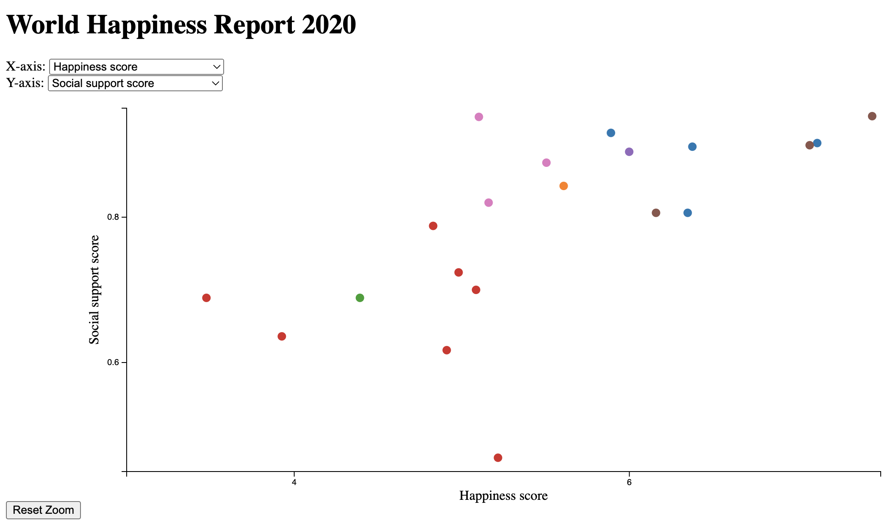

# Final Project

## Project Planning

## Data Collection and Cleanup

## Visualization Design

| File                                                                    |                Goal                 |
|:------------------------------------------------------------------------|:-----------------------------------:|
| [G4 VIS Design.md](Visualization Design/G4 VIS Design.md)               | Generating basic Visualization code |
| [G4 VIS Improvement 1.md](Visualization Design/G4 VIS Improvement 1.md) |   Improving functionality and UI    |
| [G4 VIS Improvement 2.md](Visualization Design/G4 VIS Improvement 2.md) |       Adding hover (tooltip)        |
| [G4 VIS Improvement 3.md](Visualization Design/G4 VIS Improvement 3.md) |             Adding oom              |
| [G4 VIS Improvement 4.md](Visualization Design/G4 VIS Improvement 4.md) |          Adding reset zoom          |

| Visualization designed and implemented by GPT 4. ([VIS Design.html](Visualization Design/VIS Design.html))

## Visualization Reading

## Interaction with Visualization

## Insight Discovery

## Narrative Visualization

