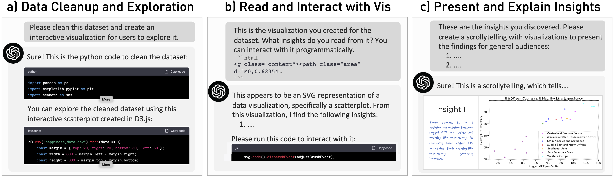

# Beyond generating code: Evaluating GPT on a Data Visualization Course

This repository contains the supplementary materials for the paper "_Beyond Generating Code: Evaluating GPT on a Data
Visualization Course_".

## Structure

